

# RNBD\_RN487x\_32Bit\_User\_Guide

-   [Introduction](#introduction)
-   [Getting Started with Software Development](#getting-started-with-software-development)
-   [Trust Zone Project Setup](#trust-zone-project-setup)
-   [RNBD Example: Running Basic Data Exchange Example Application](#rnbd-example:-running-basic-data-exchange-example-application)
-   [RN487x Example: Running Basic Data Exchange Example Application](#rn487x-example:-running-basic-data-exchange-example-application)
-   [Summary](#summary)

**List of supported MCU/MPU Device Family**

"SAMC",
"SAMD",
"SAME",
"SAML",
"SAM9x",
"PIC32MK",
"PIC32MX",
"PIC32CM",
"PIC32CMMC",
"PIC32MM1324",
"PIC32MZDA",
"PIC32MZEF",
"PIC32MZW",
"PIC32CX",
"PIC32CK",
"PIC32CXMT",
"PIC32C".

# Introduction

The MPLAB® Code Configurator [RNBD](http://mchpweb:4576/SpecIndex_FileAttach/TPT_20227216811993/70005514A.pdf)/[RN487x](https://www.microchip.com/en-us/product/RN4870) BLE Modules Library allows quick and easy configuration of the C code generated software driver based upon the user’s selected API features available from the MCC Library. Generated Driver code supports use of either BLE Module with use of a 32 Bit PIC Devices

The library module uses a Graphic User Interface \(GUI\) presented by MCC within MPLABX which allows for selection of desired configuration, and custom configurations of the protocol. Customized C code is generated within the MPLABX project, in a folder named "MCC Generated Files".

This Library uses \(1\) UART, \(1\) GPIO, and DELAY support at minimal.

Refer to the /media folder for source files & max resolution.

# Getting Started with Software Development

Steps to install IDE, compiler, tool chain and application examples on your PC

This guide will walk you through setting up your development environment with all required dependencies versions. If you are already familiar Microchip Tools, then you can find a table summarizing the dependencies below

**Tools and Harmony Component Versions**

|IDE, Compiler and MCC plugin|Version|Location|
|----------------------------|-------|--------|
|MPLAB X IDE|v6.05|[MPLAB X IDE Website](https://www.microchip.com/en-us/tools-resources/develop/mplab-x-ide#tabs)|
|XC32 Compiler|v4.10 or above|[Web](https://www.microchip.com/en-us/tools-resources/develop/mplab-xc-compilers)|
|Microchip Code Configurator\(MCC\)|5.2.1 or above|[MPLAB X IDE \> Tools \>Plugins](https://internal.onlinedocs.microchip.com/pr/GUID-99E91F8E-E9F7-4C2C-B98A-E9662A2ABA50-en-US-1/GUID-A55E9342-CE44-4A91-86BB-FEC6706FCD1C.html)|
|Device Family Pack \(DFP\) Trust Zone|PIC32CM-LS\_DFP \(v1.1.162\)|Device: PIC32CM5164LS00100|

 

**Harmony Components**:

|**Harmony components to be cloned with MCC Content Manager**|**Version**|
|------------------------------------------------------------|-----------|
|csp|v3.20.0|
|core|v3.13.5|
|bsp|v3.21.1|
|CMSIS-FreeRTOS|v10.5.1|
|wireless_rnbd|v2.0.4 or above|

# Trust Zone Project Setup

 

1.  Create MPLAB Harmony Project with below device and DFP version
    -   Device: PIC32CM5164LS00100
    -   XC32 Compiler: v4.10
    -   DFP: PIC32CM-LS\_DFP \(v1.1.162\)
     
**1.1** Create new 32-bit MCC Harmony Project as shown below

   

  

   

  **1.2** Select the **Framework Path** \(Framework path must match SDK setup document\)and select **Next**

   

  

   

  **1.3** Select Project Folder and select Next

   

  

   

  **1.4** Select the device "PIC32CM5164LS00100" for standalone project using the PIC32CM-LS device family in the "Target Device" and click Finish

   

  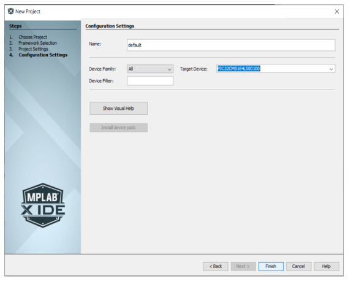

   

  **1.5** MPLABx Code Configurator will be launched automatically. Then Select **"MPLAB Harmony"** and Click Next for the Harmony Framework Path.

   

  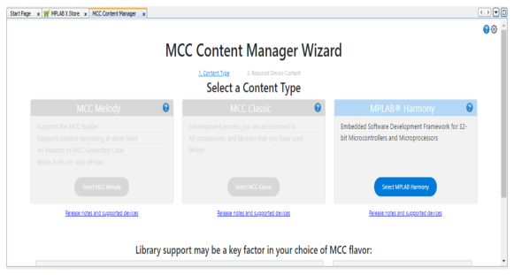

   

  **1.6** Select **"Finish"**

   

  

   

  **1.7** Project Graph window of the Configurator may have predefined components

   

  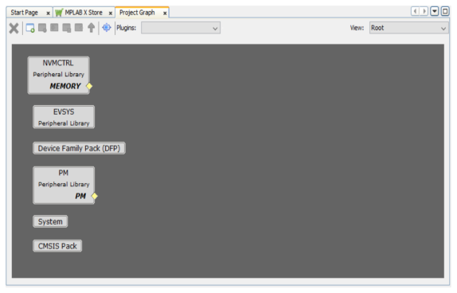

   

  Right click on the project properties and verify the selected configuration

   

  

   

2.  After creating the project as shown in the above step go to device resource and verify RNBD was under Wireless component

     

    

     

    Click on Plus icon under RNBD to add it under the Project Resource

     

    

     

3.  Project Graph and RNBD/RN487x Module Configuration

     

    

     

    User can Select **RNBD** or **RN487x** under the Select Module Type Drop Down either of the one as shown below

     

    

     

4.  Selecting Example Application

     

    -   Expand the Drop down under Select Example Application option and choose Basic Data Exchange as shown below
         

        

     

    **4.1 Basic Data Exchange:**

     

    -   Basic Data Exchange uses only **ONE** SERCOM for the Data Transmission

         

        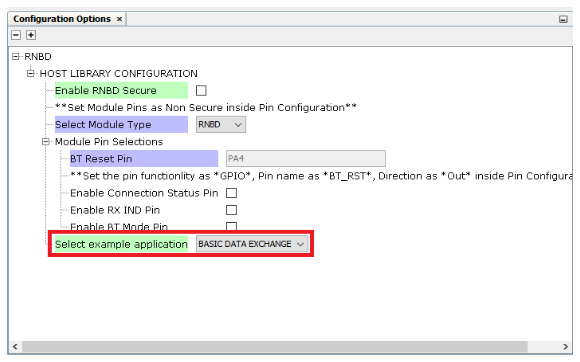

         

        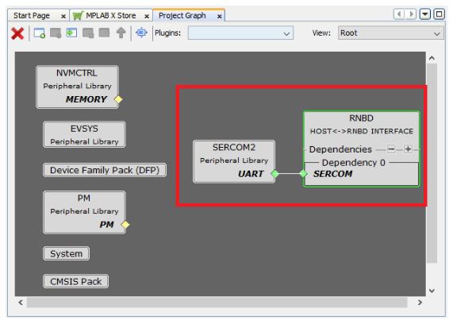

         

        

         

     

5.  PIN Settings for Example Application:

     

    -   Basic Data Exchange Pin Settings

        

     

6.  Enabling RNBD/RN487x Secure and Non Secure for Trust Zone Devices

    Click the below check box to Enable or Disable the RNBD secure configuration

     

    

     

7.  Table for Secure and Non-Secure Configuration

     

    |S.no|RNBD Secure \(Check Box in the UI\)|Dependency\(SERCOM\)|Pins|
    |----|-----------------------------------|--------------------|----|
    |1|Non Secure|Non Secure|Non Secure|
    |2|Non Secure|Secure|Non Secure|
    |3|Secure|Secure|Secure|

     

    **Note:** If RNBD Secure \(Check Box in the UI\) is marked to secure then BT\_RST pin settings should be Secured and if RNBD Secure \(Check Box in the UI\) is marked to Non-secure then BT\_RST pin settings should be Non-Secure

     

    -   **Case1:** \(RNBD: Non-Secure, Dependency: Non-Secure, BT\_RST Pin: Non-Secure\)
        -   **RNBD Secure \(Check Box in the UI\) –\> Unchecked \(Non-Secure\)** as shown below

             

            

             

        -   **Dependency –\> Non-Secure**

             

            -   Goto –\> Project Graph –\> expand the plugins drop down –\> and select Arm TRUSTZONE for Armv8-M

                 

                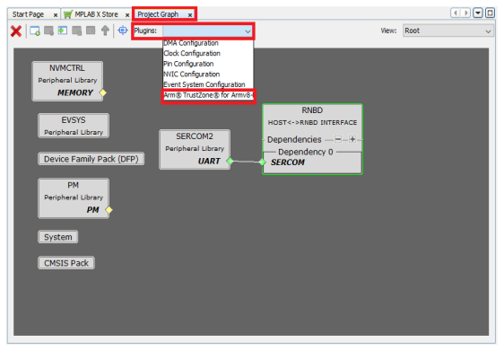

                 

            -   Select **Peripheral Configuration** as shown below

                 

                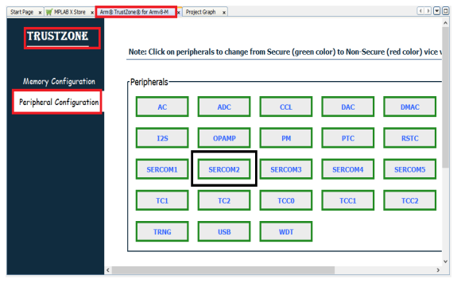

                 

            -   **NOTE:** Set SERCOM2 from secure to Non-Secure

                 

                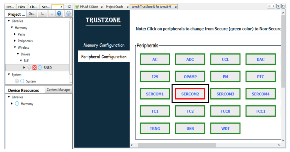

                 

             

        -   **Pin Settings –\> Non-Secure**

             

            -   Goto –\> Project Graph –\> expand the plugins drop down –\> and select Pin Configuration as shown below

                 

                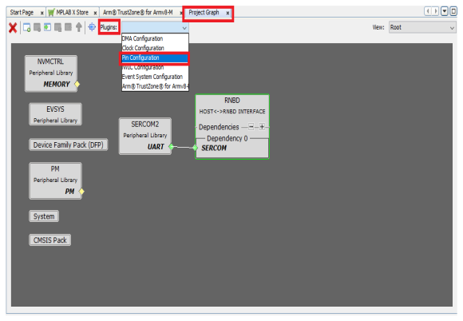

                 

            -   Set **BT\_RST** pin to **Non-Secure** under PIN Security Mode as shown below

                 

                

                 

             

        -   **Project Structure:**

            Click Generate Button under Project Resource for Code Generation to the selected configuration

             

            

             

            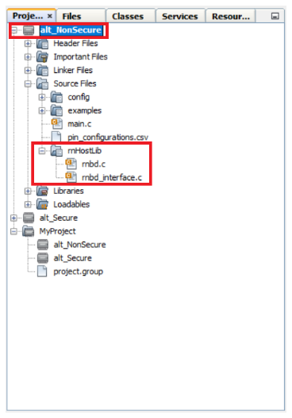

             

        -   **Adding example application to main.c**

             

            -   Once after Generation is complete include the headers for **RNBD** or **RN487x** as shown below
                -   if **Select Module Type** is selected**n** is for **RNBD**: \#include "examples/rnbd\_example.h"
                -   if **Select Module Type** is selected for **RN487x**: \#include "examples/rn487x\_example.h"

                     

                    

                     

                    Call the function  **RNBD\_Example\_Initialized\(\); or RN487x\_Example\_Initialized\(\);** in **main\(\)** after **SYS\_Initialize \( NULL \);**

             

        -   **Build the Generated Project:**

             

            

             

        -   **Program to the Development Board**

             

            

             

            This is the End of **Case1** project kindly refer[RNBD](#rnbd-example:-running-basic-data-exchange-example-application) or [RN487x](#rn487x-example:-running-basic-data-exchange-example-application) Running Example Application.

    -   **Case 2:** \(RNBD: **Non-Secure**, Dependency **: Secure**, BT\_RST Pin: **Non-Secure**\)

         

        -   **RNBD Secure \(Check Box in the UI\) –\>**Unchecked \(Non-Secure\)** as shown below

             

            

             

        -   **Dependency –\> Secure**

             

            -   Goto –\> Project Graph –\> expand the plugins drop down –\> and select Arm TRUSTZONE for Armv8-M

                

            -   Select **Peripheral Configuration** as shown below

                 

                

                 

            -   **NOTE**: Set SERCOM2 from secure to Non-Secure
             

        -   **Pin Settings –\> Non-Secure**

             

            -   Goto –\> Project Graph –\> expand the plugins drop down –\> and select Pin Configuration as shown below

                 

                

                 

            -   Set **BT\_RST** pin to **Non-Secure** under PIN Security Mode as shown below

                 

                

                 

             

        -   **Project Folder Structure:**

            Click Generate Button under Project Resource for Code Generation to the selected configuration

             

            

             

             

            

             

        -   **Adding example application to main.c**

             

            -   Once after Generation is complete include the headers for RNBD or RN487x as shown below
                -   if **Select Module Type** is selected for **RNBD**: \#include "examples/rnbd\_example.h"
                -   if **Select Module Type** is selected for**RN487x**: \#include "examples/rn487x\_example.h"

                     

                    

                     

                    Call the function **RNBD\_Example\_Initialized\(\); or RN487x\_Example\_Initialized\(\);** in **main\(\)** after **SYS\_Initialize \( NULL \);**

             

        -   **Build the Generated Project:**

             

            

             

        -   **Program to the Development Board**

             

            

             

            This is the End of **Case2** project kindly refer [RNBD](#rnbd-example:-running-basic-data-exchange-example-application) or [RN487x](#rn487x-example:-running-basic-data-exchange-example-application) Running Example Application.

         

    -   **Case 3**: \(RNBD: **Secure**, Dependency: **Secure**, BT\_RST Pin: **Secure**\)

         

        1.  **Scenario 1:**

            -   **RNBD Secure \(Check Box in the UI\) –\> Enable Check \(Secure\)**

                 

                **Note:** **Generate RNBD Non Secure Entry** check box Disabled \(Unchecked\) as shown below

                 

                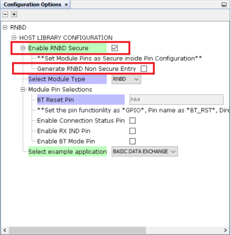

                 

            -   **Dependency –\> Secure**

                 

                -   Goto –\> Project Graph –\> expand the plugins drop down –\> and select Arm TRUSTZONE for Armv8-M

                    

                -   Select **Peripheral Configuration** as shown below

                     

                    

                     

                    **NOTE**: Set SERCOM2 from secure to Non-Secure

                 

            -   **Pin Settings –\> Secure**

                 

                -   Goto –\> Project Graph –\> expand the plugins drop down –\> and select Pin Configuration as shown below

                     

                    

                     

                -   Set **BT\_RST** pin to **Non-Secure** under PIN Security Mode as shown below

                     

                    

                     

                 

            -   **Project Folder Structure:**

                Click Generate Button under Project Resource for Code Generation to the selected configuration

                 

                

                 

                

                 

            -   **Adding example application to main.c**

                 

                -   Once after Generation is complete include the headers for RNBD or RN487x as shown below
                    -   if **Select Module Type** is selected for **RNBD**: \#include "examples/rnbd\_example.h"
                    -   if **Select Module Type** is selected for **RN487x**: \#include "examples/rn487x\_example.h"

                         

                        

                         

                        Call the function **RNBD\_Example\_Initialized\(\); or RN487x\_Example\_Initialized\(\);** in **main\(\)** after **SYS\_Initialize \( NULL \);**

                 

            -   **Build the Generated Project:**

                 

                

                 

            -   **Program to the Development Board**

                 

                

                 

            This is the End of **Case3 –\> Scenario 1** project kindly refer [RNBD](#rnbd-example:-running-basic-data-exchange-example-application) or [RN487x](#rn487x-example:-running-basic-data-exchange-example-application) Running Example Application

        2.  **Scenario 2**:

             

            -   **RNBD Secure \(Check Box in the UI\) –\> Enable Check \(Secure\)**

                **Note:** **Generate RNBD Non Secure Entry** check box Enabled \(checked\) as shown below

                 

                

                 

            -   **Dependency –\> Secure**

                 

                -   Goto –\> Project Graph –\> expand the plugins drop down –\> and select Arm TRUSTZONE for Armv8-M

                    

                -   Select **Peripheral Configuration** as shown below

                     

                    

                     

                    **NOTE**: Set SERCOM2 from secure to Non-Secure

                 

            -   **Pin Settings –\> Secure**

                 

                -   Goto –\> Project Graph –\> expand the plugins drop down –\> and select Pin Configuration as shown below

                     

                    

                     

                -   Set **BT\_RST** pin to **Non-Secure** under PIN Security Mode as shown below

                     

                    

                     

                 

            -   **Project Folder Structure:**

                Click Generate Button under Project Resource for Code Generation to the selected configuration

                 

                

                 

                Verify the RNBD/RN487x Non-Secure Entry code Generation as shown below

                 

                

                 

            -   **Adding example application to main.c**

                 

                -   Once after Generation is complete include the headers for RNBD or RN487x as shown below
                    -   if **Select Module Type** is selected for **RNBD**: \#include "examples/rnbd\_example.h"
                    -   if **Select Module Type** is selected for **RN487x**: \#include "examples/rn487x\_example.h"

                         

                        

                         

                        Call the function **RNBD\_Example\_Initialized\(\); or RN487x\_Example\_Initialized\(\);** in **main\(\)** after **SYS\_Initialize \( NULL \);**

                 

            -   **Build the Generated Project:**

                 

                

                 

            -   **Program to the Development Board**

                 

                

                 

                This is the End of **Case3 –\> Scenario 2** project kindly refer [RNBD](#rnbd-example:-running-basic-data-exchange-example-application) or [RN487x](#rn487x-example:-running-basic-data-exchange-example-application) Running Example Application

             

# RNBD Example: Running Basic Data Exchange Example Application

**Basic Data Exchange:**

This example shows how an MCU can be programmed to transmit data to a smart phone over BLE. Here the MCU device will send Periodic Transmission of a single character when **STREAM\_OPEN** is processed through the Message Handler. This indicates to the MCU & RNBD Module that the application is in a DATA STREAMING mode of operation and can expect to hear data over the BLE connection.

\#define DEMO\_PERIODIC\_TRANSMIT\_COUNT \(10000\)

\#define DEMO\_PERIODIC\_CHARACTER \(‘1’\)

Are used in the example can be found \#defined at the top of rnbd\_example.c

 

 

1.  Download and Install Phone Application for demonstration:

  1.1 Search **Microchip Bluetooth Data** by **Microchip Technology Inc** from the [App Store](https://apps.apple.com/us/app/microchip-bluetooth-data/id1319166097) or from [Google Play Store](https://play.google.com/store/apps/details?id=com.microchip.bluetooth.data&hl=en_IN&gl=US).

     

    

     

2.  Launch the Phone Application

     

    

     

    Click on the 'BLE Smart' Sub Apps as shown below:

    

3.  The Application scans the area for Bluetooth devices within a range. Look for "RNBD" devices under the scanned list.

     

    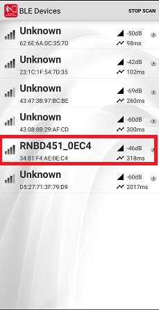

     

4.  On selecting the "RNBD" device from the list will be ready to connect with RNBD Module once you click on CONNECT Button

     

    

     

5.  Once connected, the Microchip Bluetooth App discovers all the services and characteristics supported by the RNBD451 device as shown in the following figure.

    

6.  Click the **Microchip Data Service** Option and Select the **Microchip Data Characteristic** and Write Notify Indication to receive the data in Mobile App.

    

7.  Select **Listen for notifications** on the application.
    -   It may be required to "enable notification" access to the app on the phone.

        Data will begin to Send at a Periodic Rate to the device.

        Data will become visible beneath the **Notify/Listen Toggle** Option.

        -   **Before Enabling** the **Notify/Indicate Toggle** Button:

            

            **After Enabling** the **Notify/Indicate Toggle** Button Mobile App can read the data **31\(Hex Value\)** which was sent from RNBD Module.

            

 

# RN487x Example: Running Basic Data Exchange Example Application

**Basic Data Exchange:**

This example shows how an MCU can be programmed to transmit data to a smart phone over BLE. Here the MCU device will send Periodic Transmission of a single character when **STREAM\_OPEN** is processed through the Message Handler.

This indicates to the MCU & RN487x Module that the application is in a DATA STREAMING mode of operation and can expect to hear data over the BLE connection.

\#define DEMO\_PERIODIC\_TRANSMIT\_COUNT\(10000\)
 
\#define DEMO\_PERIODIC\_CHARACTER \(‘1’\)

Are used in the example can be found \#defined at the top of rn487x\_example.c

 

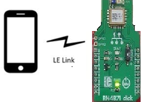

 

1.  Download and Install Phone Application for demonstration:

    1.1  Search **Microchip Bluetooth Data** by **Microchip Technology Inc** from the [App Store](https://apps.apple.com/us/app/microchip-bluetooth-data/id1319166097) or from [Google Play Store](https://play.google.com/store/apps/details?id=com.microchip.bluetooth.data&hl=en_IN&gl=US).

     

    

     

2.  Launch the Phone Application

     

    

     

    Click on the 'BLE Smart' Sub Apps as shown below:

    

3.  The Application scans the area for Bluetooth devices within a range. Look for "RN487x" devices under the scanned list.

     

    

     

4.  On selecting the "RN487x" device from the list will be ready to connect with RNBD Module once you click on CONNECT Button

     

    

     

5.  Once connected, the Microchip Bluetooth App discovers all the services and characteristics supported by the RN487x device as shown in the following figure.

     

    

     

6.  Click the **Microchip Data Service** Option and Select the **Microchip Data Characteristic** and Write Notify Indication to receive the data in Mobile App.

     

    

     

7.  Select **Listen for notifications** on the application.
    -   It may be required to "enable notification" access to the app on the phone.

        Data will begin to Send at a Periodic Rate to the device.

        Data will become visible beneath the **Notify/Listen Toggle** Option.

        -   **Before Enabling** the**Notify/Indicate Toggle** Button:

             

            

             

            **After Enabling** the **Notify/Indicate Toggle Button** Mobile App can read the data **31\(Hex Value\)** which was sent from RN487x Module.

            

 

# Summary

**Command, Data Communication with Asynchronized Message Processing:**

This driver contains, at its' core, the inherent code capability of distinguishing between **Message** exchange and **Data** exchange between the connected MCU and Module devices.

The library supplies all required Application Programming Interfaces \(APIs\) required to create functional implementation of operation a BLE connected end-device. Through the MCC configuration the physical connection of the \(3\) required pins can be selected through the GUI. These are the \(2\) UART pins used for communication, and control of the **RST\_N** connected to the RNBD Module.

Additionally this Library allows for extension of Module pin behaviors through the simple RNBD Module object interface; where any device/project specific instantiations exist **rnbd\_interface.c/h**/**rn487x\_interface.c/h**

A brief description of the Interface, and object extension is described below:

iRNBD\_FunctionPtrs\_t is a typedef struct which can be found in **rnbd\_interface.h**/**rn487x\_interface.h** and consist of \(9\) function pointers. In the **rnbd\_interface.c**/**rn487x\_interface.c**, the concrete creation of RNBD as an object is instantiated. Within **rnbd\_interface.c**/**rn487x\_interface.c** are the **private static** implementations of desired behavior. In some cases, such as DELAY or UART, the supporting behavior is supplied through another supporting library module. When applicable ‘inline’ has been used to reduce stack depth overhead.

 

 

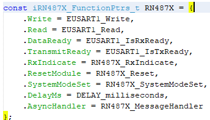

 

The driver library itself should not require any modifications or injections by the user unless to expand upon the supported command implementations **rnbd.c/h**

**Configurable Module Hardware Requirement\(s\):**

A single UART instance used for communication between MCU and Module:

|Library Name: Output\(s\)|Module: Input\(s\)|Description|Module Physical Defaults|
|-------------------------|------------------|-----------|------------------------|
|BT\_MODE|P2\_0|  1 : Application Mode  0 : Test Mode/Flash Update/EEPROM Configuration |Active-Low, Internal Pull-High|
|BT\_RST|RST\_N|Module Reset|Active-Low, Internal Pull-High|
|BT\_RX\_IND|P3\_3|Configured as UART RX Indication pin|Active-Low|

 
