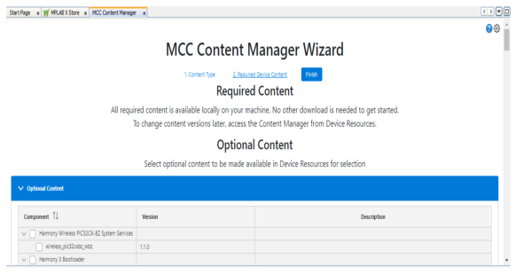
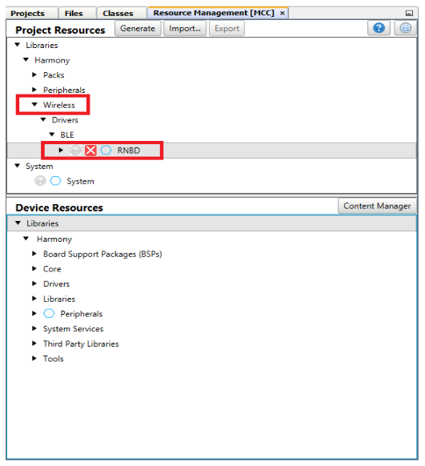
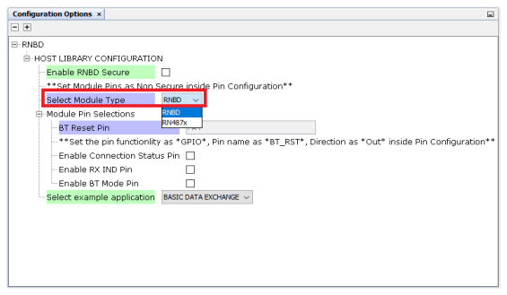
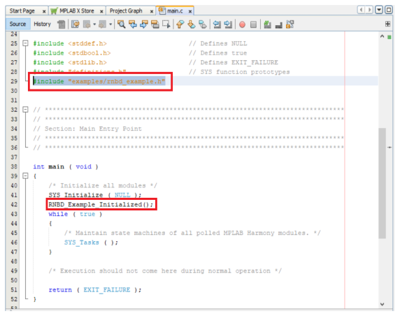
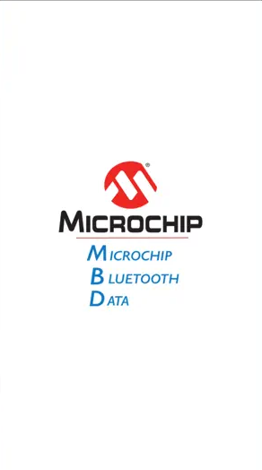
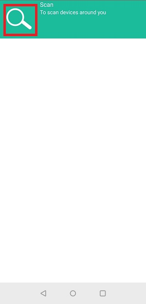

# RNBD\_RN487x\_32Bit\_User\_Guide

-   [Introduction](#introduction)
-   [Getting Started with Software Development](#getting-started-with-software-development)
-   [Project Setup](#project-setup)
-   [RNBD Example: Running Transparent UART Example Application](#rnbd-example:-running-transparent-uart-example-application)
-   [RN487x Example: Running Transparent UART Example Application](#rn487x-example:-running-transparent-uart-example-application)
-   [Summary](#summary)

**List of supported MCU/MPU Device Family**

"SAMC",
"SAMD",
"SAME",
"SAML",
"SAM9x",
"PIC32MK",
"PIC32MX",
"PIC32CM",
"PIC32CMMC",
"PIC32MM1324",
"PIC32MZDA",
"PIC32MZEF",
"PIC32MZW",
"PIC32CX",
"PIC32CK",
"PIC32CXMT",
"PIC32C".

# Introduction

The MPLAB® Code Configurator [RNBD](http://mchpweb:4576/SpecIndex_FileAttach/TPT_20227216811993/70005514A.pdf)/[RN487x](https://www.microchip.com/en-us/product/RN4870) BLE Modules Library allows quick and easy configuration of the C code generated software driver based upon the user’s selected API features available from the MCC Library. Generated Driver code supports use of either BLE Module with use of a 32 Bit PIC Devices

The library module uses a Graphic User Interface \(GUI\) presented by MCC within MPLABX which allows for selection of desired configuration, and custom configurations of the protocol. Customized C code is generated within the MPLABX project, in a folder named "MCC Generated Files".

This Library uses \(1\) UART, \(1\) GPIO, and DELAY support at minimal.

Refer to the /media folder for source files & max resolution.

# Getting Started with Software Development

Steps to install IDE, compiler, tool chain and application examples on your PC

This guide will walk you through setting up your development environment with all required dependencies versions. If you are already familiar Microchip Tools, then you can find a table summarizing the dependencies below

**Tools and Harmony Component Versions**

|IDE, Compiler and MCC plugin|Version|Location|
|----------------------------|-------|--------|
|MPLAB X IDE|v6.20|[MPLAB X IDE Website](https://www.microchip.com/en-us/tools-resources/develop/mplab-x-ide#tabs)|
|XC32 Compiler|v4.45 or above|[Web](https://www.microchip.com/en-us/tools-resources/develop/mplab-xc-compilers)|
|Microchip Code Configurator\(MCC\)|5.5.1 or above|[MPLAB X IDE \> Tools \>Plugins](https://internal.onlinedocs.microchip.com/pr/GUID-99E91F8E-E9F7-4C2C-B98A-E9662A2ABA50-en-US-1/GUID-A55E9342-CE44-4A91-86BB-FEC6706FCD1C.html)|
|Device Family Pack \(DFP\)|PIC32CM-MC\_DFP \(v1.4.67\)|Device: PIC32CM1216MC00048|

 

**Harmony Components**:

|**Harmony components to be cloned with MCC Content Manager**|**Version**|
|------------------------------------------------------------|-----------|
|csp|v3.20.0|
|core|v3.13.5|
|bsp|v3.21.1|
|CMSIS-FreeRTOS|v10.5.1|
|wireless_rnbd|v2.0.4 or above|

# Project Setup
 

1.  Create MPLAB Harmony Project with below device and DFP version

    -   Device: PIC32CM1216MC00048
    -   XC32 Compiler: v4.45
    -   DFP: PIC32CM-MC\_DFP \(v1.4.67\)
     

    **1.1** Create new 32-bit MCC Harmony Project as shown below

      

       

      **1.2** Select the device "PIC32CM1216MC00048" for application project using the PIC32CM device family

       

      

       

      **1.3** Select the compiler

       

      

       

      **1.4** Select the project name and  **Framework Path** \(Framework path must match SDK setup document\) and click Finish

       

      

       

    **1.5** MPLABx Code Configurator will be launched automatically. Then Select **"MPLAB Harmony"** and Click Next for the Harmony Framework Path.

     

    

     

    **1.6** Select **"Finish"**

     

    

     

    **1.7** Project Graph window of the Configurator may have predefined components

     

    

     

    Right click on the project properties and verify the selected configuration

     

    

     

2.  After creating the project as shown in the above step go to device resource and verify RNBD was under Wireless component

     

    

     

    Click on Plus icon under RNBD to add it under the Project Resource

     

    

     

3.  Project Graph and RNBD/RN487x Module Configuration

     

    

     

    User can Select **RNBD** or **RN487x** under the Select Module Type Drop Down either of the one as shown below

     

    

     

4.  Selecting Example Application

     

    -   Expand the Drop down under Select Example Application option and choose Transparent UART as shown below
     

      

       

      

    -   Transparent UART Application uses **TWO** SERCOM as a Dependency for the Data Transmission

      

      

      RNBD/RN487x Depenedency0 **SERCOM3** Tx/Rx Pad settings

      

      RNBD/RN487x Depenedency1 **SERCOM0** Tx/Rx Pad settings

      

5.  PIN Settings for Example Application:

    -   Transparent UART Pin Settings

         

        

         

6.  Code Generation and adding the example application to main.c

     

    -   After making the all the above settings click on Generate in which code will be generated for RNBD or RN487x as per the selection

         

        

         

    -   Once after Generation is complete include the headers for **RNBD** or **RN487x** as shown below
        -   if **Select Module Type** is selected for **RNBD**: \#include "examples/rnbd\_example.h"
        -   if **Select Module Type** is selected for **RN487x**: \#include "examples/rn487x\_example.h"

             

            

             

            Call the function **RNBD\_Example\_Initialized\(\); or RN487x\_Example\_Initialized\(\);** in **main\(\)** after **SYS\_Initialize \( NULL \);**

     

7.  Build the Generated Project:

     

    

     

8.  Program to the Development Board

     

    

     

 

# RNBD Example: Running Transparent UART Example Application

 

 

 

|Transparent Serial:|
|-------------------|
|This example will demonstrate data transmitted from a PC serial terminal is written to a smart phone app and vice versa. The MCU device will act as a bridge, and pass data between RNBD Module to MCU via Serial Terminal. This action will occur when STREAM\_OPEN is processed through the Message Handler. For this example, data typed into the Serial Terminal will appear on the BLE Phone Application, and Data sent from the Application will appear on the Serial Terminal.|

 

1.  Download and Install Phone Application for demonstration:
    -   Search **Microchip Bluetooth Data** by **Microchip Technology Inc** from the [App Store](https://apps.apple.com/us/app/microchip-bluetooth-data/id1319166097) or from [Google Play](https://play.google.com/store/apps/details?id=com.microchip.bluetooth.data&hl=en_IN&gl=US).

     

    

     

2.  Launch the Phone Application

     

    

     

    After Installing open the MBD App and Click on **BLE UART** Sub Apps:

     

    

     

3.  On Selecting **PIC32CXBZ** scan for available devices to connect. The Application scans the area for Bluetooth devices within a range. Look for "RNBD" devices under the scanned list.

     

    

     

4.  For Transparent Serial only: Open a "Serial Terminal" Program such as Tera Term, Real term, PuTTY, Serial; or similar. Baud Rate will be configured as: 115200

     

    

     

    

     

5.  Once Connected with RNBD451\_0EC4 click on **Text Mode** at bottom of the settings as shown below to initiate the data transfer.

     

    

     

    - Check Serial Terminal for the status of the connection.

     

    

     

6.  Enter the text to be transferred from mobile to RNB45x device and click send button

     

    

     

    - The data will be received at the RNBD45x side and will be displayed in serial terminal of RNBD45x

     

    

     

7.  Type any data on the serial terminal of the RNBD45x to send to the Microchip Bluetooth Data App, which is received and printed on the receive view of the Microchip Bluetooth App.

     

    

     

    

     

# RN487x Example: Running Transparent UART Example Application

 

 

 

|Transparent Serial:|
|-------------------|
|This example will demonstrate data transmitted from a PC serial terminal is written to a smart phone app and vice versa. The MCU device will act as a bridge, and pass data between RN487x Module to MCU via Serial Terminal. This action will occur when STREAM\_OPEN is processed through the Message Handler. For this example, data typed into the Serial Terminal will appear on the BLE Phone Application, and Data sent from the Application will appear on the Serial Terminal.|

 

1.  Download and Install Phone Application for demonstration:
    -   Search **Microchip Bluetooth Data** by **Microchip Technology Inc** from the [App Store](https://apps.apple.com/us/app/microchip-bluetooth-data/id1319166097) or from [Google Play](https://play.google.com/store/apps/details?id=com.microchip.bluetooth.data&hl=en_IN&gl=US).

     

    

     

2.  Launch the Phone Application

     

    

     

    After Installing open the MBD App and Click on **BLE UART** Sub Apps:

     

    

     

3.  On Selecting **BM70** scan for available devices to connect.

     

    

     

    Click on the below Scan image to scan the Nearby "RN487x-xxxx"

     

    

     

    The Application scans the area for Bluetooth devices within a range. Look for  "RN487x-xxxx" devices under the scanned list.

     

    

     

4.  For Transparent Serial only: Open a "Serial Terminal" Program such as Tera Term, Realterm, PuTTY, Serial; or similar. Baud Rate will be configured as: 115200

     

    

     

     

    

     

5.  Once Connected with RN487x-xxxx click on **Transfer data to device** as shown below to initiate the data transfer.

     

    

     

    - Check Serial Terminal for the status of the connection.

     

    

     

6.  Enter the text to be transferred from mobile to RN487x-xxxx device and click send button

     

    

     

    - The data will be received at the RN487x-xxxx side and will be displayed in  serial terminal of RNBD45x

     

    

     

7.  Type any data on the serial terminal of the RN487x-xxxx to send to the Microchip Bluetooth Data App, which is received and printed on the receive view of the Microchip Bluetooth App.

     

    

     

    

     

# Summary

**Command, Data Communication with Asynchronized Message Processing:**

This driver contains, at its' core, the inherent code capability of distinguishing between **Message** exchange and **Data** exchange between the connected MCU and Module devices.

The library supplies all required Application Programming Interfaces \(APIs\) required to create functional implementation of operation a BLE connected end-device. Through the MCC configuration the physical connection of the \(3\) required pins can be selected through the GUI. These are the \(2\) UART pins used for communication, and control of the **RST\_N** connected to the RNBD Module.

Additionally this Library allows for extension of Module pin behaviors through the simple RNBD Module object interface; where any device/project specific instantiations exist **rnbd\_interface.c/h**/**rn487x\_interface.c/h**

A brief description of the Interface, and object extension is described below:

iRNBD\_FunctionPtrs\_t is a typedef struct which can be found in **rnbd\_interface.h**/**rn487x\_interface.h** and consist of \(9\) function pointers. In the **rnbd\_interface.c**/**rn487x\_interface.c**, the concrete creation of RNBD as an object is instantiated. Within **rnbd\_interface.c**/**rn487x\_interface.c** are the **private static** implementations of desired behavior. In some cases, such as DELAY or UART, the supporting behavior is supplied through another supporting library module. When applicable ‘inline’ has been used to reduce stack depth overhead.

 

 

 

The driver library itself should not require any modifications or injections by the user unless to expand upon the supported command implementations **rnbd.c/h**

**Configurable Module Hardware Requirement\(s\):**

A single UART instance used for communication between MCU and Module:

|Library Name: Output\(s\)|Module: Input\(s\)|Description|Module Physical Defaults|
|-------------------------|------------------|-----------|------------------------|
|BT\_MODE|P2\_0|  1 : Application Mode  0 : Test Mode/Flash Update/EEPROM Configuration |Active-Low, Internal Pull-High|
|BT\_RST|RST\_N|Module Reset|Active-Low, Internal Pull-High|
|BT\_RX\_IND|P3\_3|Configured as UART RX Indication pin|Active-Low|

 
